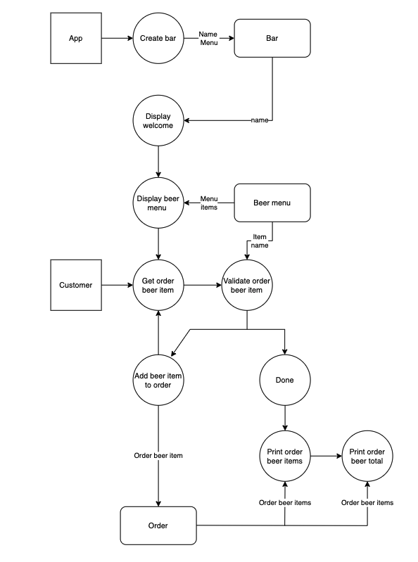

# Terminal Application

This app is a beer menu built in Ruby!

## Source control repository

Link to GitHub repository: [terminal-app](https://github.com/malanchristiansen/terminal-app)

## Software Development Plan

- **Description:** This application will display a beer menu that a customer can choose a beer from and how many beers the customer would like. Then it calculates the customer’s bill based on choice and quantity. It is supposed to be a quick and easy experience. Additionally, the displayed messages will be in colours and art design to please the customers visually. This will be implemented by using gems from [artii](https://github.com/miketierney/artii), [colorize](https://github.com/fazibear/colorize), [tty-box](https://github.com/piotrmurach/tty-box), and [terminal-table](https://github.com/tj/terminal-table). The app will also help the user if the user is have typed invalid values or if the user wants a quick exit, these messages will also be color-coded using colorize. Helping the user will be done through error handling and displaying instructions on what the user should type instead.

- **The problem:** In this day and age customers expect a digitalized menu, the app solves that problem by being digitalised. Since it is a terminal app, it bases the groundwork for developing a digital beer menu in for example ruby on rails. The app also solves the problem if calculated the bill by automatically multiplying the price of the selected beer with the quantity of how many beers the customer wants.

- **Target audience and usability:** The identified target audience of the app is for beer lovers or just customers at a bar that want the convenience of ordering via an app instead of at the counter. The app is convenient as the customers can use it to order at a bar, they can choose an item from the menu and choose the quantity of how many beers they want. They will then get the calculated bill from their order.

  The secondary identified target audience of the app is obviously bars/cafes/restaurants that want a digitalised beer menu, so their customers can order via the app instead of at the counter. They will use the app by implementing it to solve the problem of giving their customers a digital menu.

## Features

1. Displays a welcome message incl. title, welcome, and statememt to choose a beer
   - For the title, the gem being used is [artii](https://github.com/miketierney/artii)
   - The welcome to the beer menu statement uses the gem [tty-box](https://github.com/piotrmurach/tty-box)
   - The welcome message asking the customer to order uses the gem [colorize](https://github.com/fazibear/colorize)
1. Menu options: displays beer menu of 3 beers
   - The beer menu is shown using the gem [terminal-table](https://github.com/tj/terminal-table)
1. User input: prompts user for an order. A while loop is implemented to handle the user input.
   - To get the users input, the method gets is being used
1. User input: prompts user for quantity of selected beer
   - To get the users input for quantity, the method gets is also being used
1. User output: displays total calculated bill
   - To get the calculated bill, a method is used to multiply the order choice (price) with the quantity, eg. the beer costs $10 and the customer orders 3 (He's thirsty), it is calculated $10 \* 3 = total bill: $30.
1. Displays goodbye message
   - The goodbye message also uses [colorize](https://github.com/fazibear/colorize)
1. Exit option: user can quit menu
   - For this feature, a while loop is being used. If the customer types exit it converts it to an integer 0, which displays the exit message. The method gets is used again to get the user input exit and .to_i is used convert the string to an integer.
1. Error handling: user is helped with invalid input
   - Error handling is being used when the app prompts the user for quantity. If the user types 0 or a string it is converted to and integer and a message is displayed to let the user retry to type a correct value.

## Outline of user interaction

- User runs the script run_app.sh in terminal
- User is displayed a welcome message incl. title, welcome, and statememt, which is displayed with 2 seconds in between
- The last statement asks the user to choose a number between 1, 2, 3 or exit. The numbers represent a beer item shown on the menu and exit means that the user can exit the app. The user can type the choice directly in the terminal. A while loops is implemented to handle teh user input.
  - If the user chooses one of these numbers, the user is asked about the order quantity.
  - If the user types exit, the user exits the app and is displayed a goodbye message before the app stops running.
  - If user types an invalid value, e.g. a number that is not on the menu, the user is displayed a message that tells which numbers the user can choose or if the user wants to exit.
- The second message is displayed when the user has typed a valid number in the terminal that represents the choice of beer.
  - Error handling is implemented to help the user if teh user types a string instead of a number. E.g. the user is asked about the quantity of beer and the user types "many", this will display a message asking the user to try again and type a number.
- When the user has typed choice and quantity into the terminal, the user is displayed the calculated final bill and a goodbye message. Then app stop running.

## Control flow

## Implementation plan

Trello: [Terminal Application Board](https://trello.com/b/f3tfLiOg/terminal-application)

## Instructions for application use

1. Download app from GitHub: [terminal-app](https://github.com/malanchristiansen/terminal-app)
1. Run `bundle install` to install required gems
1. Run bash script `./run_app.sh`
